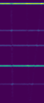
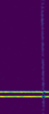
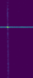
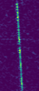
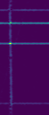
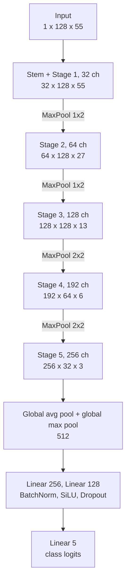
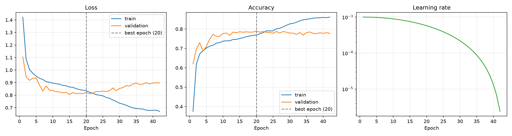
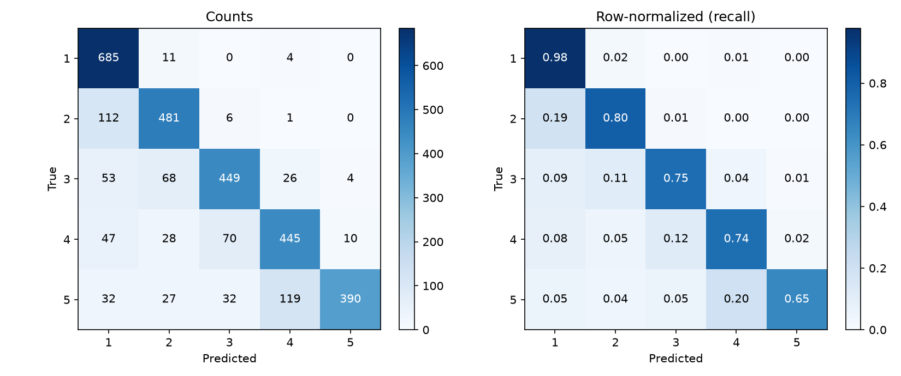
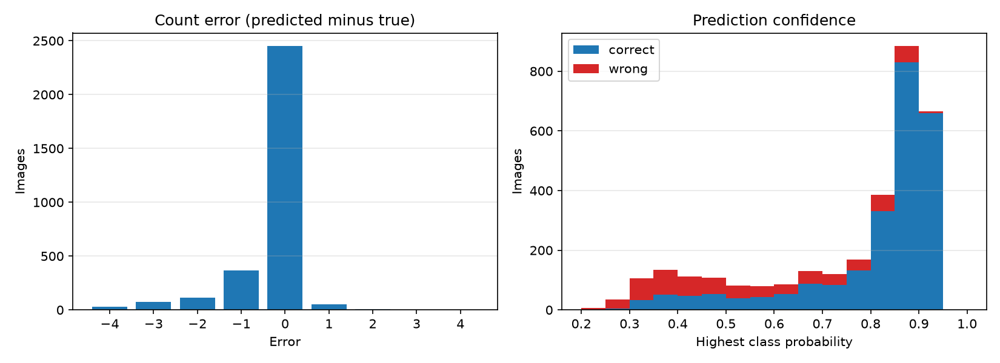
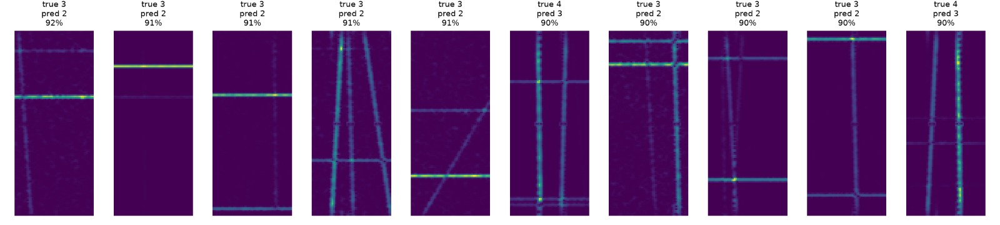

# Signal Object Detection

A ResNet written from scratch in PyTorch that counts objects in noisy radio signal images.

## Task

- Each image contains 1 to 5 objects. The number of objects is the class.
- Treated as 5-way classification, as the task defines it. Predictions are labels 1 to 5, not fractional counts.
- Train: 15,500 images with labels. Test: 5,500 images.
- Images are 128 x 55 (height x width) PNGs, colormapped with viridis. They are read as grayscale.
- Files: `train.csv` (`id,label`), `test.csv` (`id`), and a prediction file with `id,label`.
- Dataset: [Kaggle, signals-dataset](https://www.kaggle.com/datasets/robupetrurazvan/signals-dataset)

Random training samples, with the number of objects as the label:

<table>
  <tr>
    <td align="center"></td>
    <td align="center"></td>
    <td align="center"></td>
    <td align="center"></td>
    <td align="center"></td>
  </tr>
  <tr>
    <td align="center">Label 5</td>
    <td align="center">Label 2</td>
    <td align="center">Label 1</td>
    <td align="center">Label 1</td>
    <td align="center">Label 4</td>
  </tr>
</table>

## Pipeline

- Read image as grayscale, scale to [0, 1].
- Stratified split of the training set: 80% train (12,400), 20% validation (3,100).
- Augmentation on train only: Gaussian noise (std 0.02, p 0.25) and a random shift of up to 2 px (p 0.20).
- Loss: cross-entropy with inverse-frequency class weights (class 1 has 3,500 images, the others 3,000) and label smoothing 0.1.
- Optimizer: AdamW, lr 1e-3, weight decay 1e-4, cosine decay to 1e-6, 42 epochs, batch size 64, gradient clipping at 1.0.
- The epoch with the best validation accuracy is kept and used to predict the test set.
- No hyperparameter tuning. All values above are fixed defaults.

## How a ResNet works

- Problem: very deep plain networks trained worse than shallower ones, even on the training set. This is an optimization issue (degradation), not overfitting.
- Idea: a block learns a residual `F(x)` and outputs `F(x) + x`. The `+ x` skip connection has no parameters.
- If a block has nothing useful to add, it pushes `F(x)` toward 0. That is easier than learning the identity from scratch.
- Gradients get a direct path back: `d(F(x) + x)/dx = dF/dx + 1`. The `+ 1` keeps the signal alive through many layers.
- Basic block: two 3x3 convs, each followed by batch norm, with an activation in between. The skip is added before the final activation.
- Batch norm keeps each channel at a stable scale, which allows higher learning rates. Convs use `bias=False` because batch norm has its own shift.
- Projection shortcut: `F(x)` and `x` must have the same shape to be added. When the channel count changes, the skip uses a 1x1 conv plus batch norm. Otherwise it is the identity.
- Blocks are grouped into stages. Resolution shrinks and channels grow between stages. The end pools each channel to one number and feeds a small classifier.

## This implementation

- 10 residual blocks in 5 stages (32, 64, 128, 192, 256 channels), 4.4M parameters.
- Block: conv 3x3, batch norm, SiLU, conv 3x3, batch norm, SE, dropout, add skip, SiLU.
- 4 blocks use a projection shortcut (where the channel count changes), 6 use the identity.
- Differences from the original ResNet:
  - Stem is one 3x3 conv. The ImageNet stem (7x7 conv with stride 2, then max pool) is too aggressive for a 128 x 55 image.
  - Downsampling uses max pooling between stages instead of stride-2 convs. The first two pools only halve the width.
  - SiLU instead of ReLU.
  - Squeeze-and-excitation (SE) in each block: a learned per-channel gate in (0, 1) computed from the global average of the channel.
  - Dropout2d inside blocks (0.05 to 0.15).
  - Head concatenates global average and global max pooling (512 features), then two hidden layers (256, 128) with batch norm and dropout.



Each stage is two residual blocks. Shapes are channels x height x width.

## Files

- `data.py`: dataset, augmentation, stratified split, data loaders.
- `model.py`: SE block, residual block, ResNet.
- `train.py`: training loop, validation, metrics logging, test predictions.
- `plots.py`: plots and summary metrics from the training output.

## Metrics and plots

`train.py` writes to `output/`:

- `metrics.csv`: per epoch learning rate, train and validation loss and accuracy, seconds.
- `val_predictions.csv`: for every validation image the label, the prediction and the five class probabilities, from the best epoch.
- `val_probs.npy`: validation class probabilities of every epoch, shape (epochs, images, 5), same image order as `val_predictions.csv`. Any validation metric per epoch can be computed from it.
- `config.json`: all arguments of the run, the device and the parameter count.
- `best_model.pth` and `predictions.csv` (test set).
- Rerunning overwrites these files. Use another output directory to keep a run (`uv run train.py -h` shows how).

`plots.py` reads those files and writes to `output/plots/`:

- `curves.png`: loss, accuracy and learning rate per epoch, with the best epoch marked.
- `confusion_matrix.png`: counts and row-normalized (recall).
- `class_metrics.png` and `class_metrics.csv`: precision, recall and F1 per class.
- `errors.png`: count error (predicted minus true) and confidence of correct versus wrong predictions.
- `misclassified.png`: the most confident mistakes.
- It also prints macro F1, accuracy within one object, and mean absolute count error.

## Run

Download the [dataset](https://www.kaggle.com/datasets/robupetrurazvan/signals-dataset) into `data/` (ignored by git):

```text
data/
  train.csv
  test.csv
  train/
  test/
```

```bash
uv sync
uv run train.py
uv run plots.py
```

- `uv run train.py -h` lists the options.

## Results

- Test accuracy: 80%.
- Placed 8th of 120 students in a private university contest. The test labels are not public, so this score cannot be checked independently.
- Everything below is on the validation set (3,100 images held out from train). Training took 42 epochs at about 114 s each on a laptop GPU, 80 minutes in total.

### Validation

- Best epoch 20: accuracy 79.0%, macro F1 0.786.
- Last epoch 42: accuracy 77.8%. The best epoch is picked on this same set, so 79.0% is slightly optimistic.
- 92.6% of predictions are within one object of the true count. Mean absolute count error is 0.33.

| Class | Precision | Recall | F1 | Images |
| --- | --- | --- | --- | --- |
| 1 | 0.74 | 0.98 | 0.84 | 700 |
| 2 | 0.78 | 0.80 | 0.79 | 600 |
| 3 | 0.81 | 0.75 | 0.78 | 600 |
| 4 | 0.75 | 0.74 | 0.74 | 600 |
| 5 | 0.97 | 0.65 | 0.78 | 600 |

### Training curves



- Validation accuracy stays between 77% and 79% from epoch 13, while train accuracy keeps rising to 86%.
- Validation loss is lowest at epoch 15 (0.806) and rises afterwards, so the later epochs overfit. The saved model is from epoch 20.

### Errors



- Class 1 is almost always found (recall 0.98), but other classes are often called 1 (precision 0.74): 112 of 600 twos and 53 of 600 threes.
- Class 5 is the hardest to find (recall 0.65). 119 of 600 fives are called 4. A predicted 5 is right 97% of the time.
- 90% of the mistakes (588 of 650) predict fewer objects than the label.



- 62% of images get a confidence of at least 0.8, and 94% of those are correct. The median confidence is 0.87 for correct predictions and 0.52 for wrong ones.



- 8 of these 10 are threes predicted as twos, and 2 are fours predicted as threes. Several show only one or two visible lines.

## License

MIT. See [LICENSE](LICENSE).
